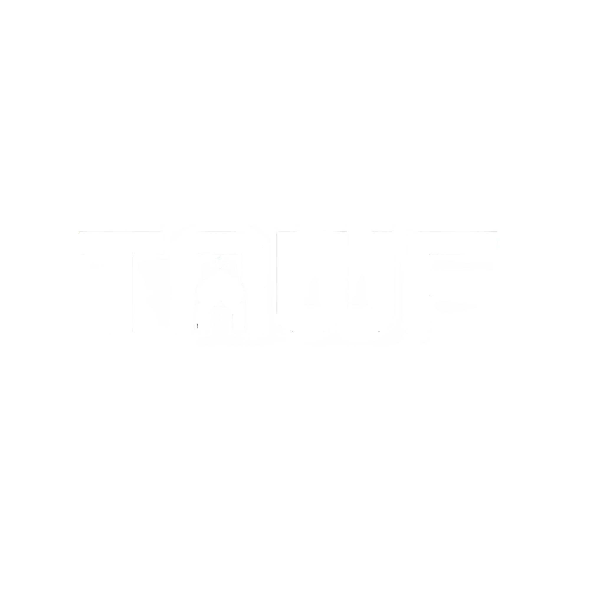

<div align="center">



# Tawf Islamic Foundation

*Rebuilding trust in Islamic charitable giving through radical transparency.*

**Where did my zakat go? Now you can know for certain.**

[](https://opensource.org/licenses/Apache-2.0)
[](https://react.dev/)
[](https://www.typescriptlang.org/)
[](https://vitejs.dev/)

</div>

---

## About

The **Tawf Islamic Foundation** is a non-profit organization building blockchain-verified transparency infrastructure for Islamic philanthropy. We serve as the public-trust cornerstone of the Tawf ecosystem, generating legitimacy through verifiable accountability.

### Our Primary Focus: Zakat Transparency

Muslims give $1+ trillion in zakat annually. The problem isn't lack of generosity—it's **lack of trust**. Donors rarely know where their money goes or if it reached the intended recipients.

We're solving this with **on-chain verification** that answers the fundamental question: *Where did my zakat go?*

### Our Target Users

We're building first for **Southeast Asian students**—young, tech-savvy Muslims who want their zakat to be:
- **Transparent**: Track every step from payment to recipient
- **Sharia-certified**: Verified by respected ulama
- **Local**: Designed for Indonesian/Malaysian context
- **Beautiful**: Mobile-first, social, shareable

### Our Mission

- Provide verifiable transparency in zakat collection and distribution
- Build Sharia-deep infrastructure for Islamic charitable institutions
- Foster genuine community ownership through open-source development
- Partner with trusted institutions (pesantrens, BMTs, mosques)

### Project Structure

```
tawf-foundation/
├── public/
│   ├── images/          # Static images (logos, assets)
│   └── icons/           # Favicon and app icons
├── src/
│   ├── components/      # React components
│   │   ├── Layout.tsx   # Main layout with nav & footer
│   │   ├── Landing.tsx  # Homepage sections
│   │   └── Manifesto.tsx # Manifesto page
│   ├── styles/          # Global CSS files
│   ├── assets/          # React-imported assets
│   ├── App.tsx          # Root app component
│   └── main.tsx         # Application entry point
├── index.html           # HTML template
├── package.json         # Dependencies & scripts
├── tsconfig.json        # TypeScript config
└── vite.config.ts       # Vite build config
```

---

## The 10-Star Product: Zakat Transparency

### Before (Current Reality)
1. Student wants to pay zakat from part-time job income
2. Googles "zakat online Indonesia" → 50+ sketchy websites
3. Picks one, pays via bank transfer
4. Receives generic WhatsApp receipt
5. **Never knows where the money went**
6. Hopes it helped someone, but... doubts linger

### After (Tawf 10-Star Experience)

**Step 1: Calculate**
- Opens zkt.app
- "How much is your zakat?" → Connects GoPay/Bank API
- AI calculates: "Your zakat mal is Rp 750,000 this month"
- Breakdown: gold savings, cash, investments—all sharia-compliant

**Step 2: Choose**
- "Who needs your zakat today?"
- Sees real-time needs:
  - 🎓 3 students need tuition (Jakarta)
  - 🏠 5 families need rent help (Surabaya)
  - 🍚 12 families need food aid (Bandung)
- Each profile has story, verification status, photo
- Sarah picks the 3 students—she was there once

**Step 3: Give**
- One tap confirmation
- Pays via GoPay (seamless, no crypto needed yet)
- **Immediately sees**:
  ```
  ✓ Payment received
  ✓ Being routed to: Pesantren Al-Ikhlas (verified partner)
  ✓ Expected distribution: Tomorrow before Zuhr
  ```

**Step 4: Witness**
- Next morning: notification + photo
- "Your zakat reached Ahmad, 20. His tuition is paid for 2 months."
- Beautiful NFT receipt appears in wallet
- Can share on Instagram: "This is where my zakat went"

**Step 5: Track**
- Opens Impact Dashboard
- "Your zakat has helped 7 students this year"
- Total given: Rp 4,500,000
- On-chain verification: scan QR → see transaction on blockchain
- **Zero doubt. 100% trust.**

---

## Our Trust Strategy

We believe blockchain is the implementation detail, not the headline. Trust comes from:

### 1. Sharia Credibility
- Recruit respected Indonesian ulama as advisors
- Public fatwa database linked to on-chain decisions
- Every smart contract audited and signed by scholars
- "Halal Verified" badges on-chain

### 2. Institution Partnerships
- Partner with trusted pesantrens and BMTs
- Their endorsement becomes social proof
- Network effect: other institutions want in

### 3. Open Source
- All code on GitHub from day one
- Public smart contract addresses
- Real-time governance dashboard
- "Audit us anytime" culture

---

## Platforms

| Platform | Purpose | Link |
|----------|---------|------|
| **zkt.app** | Transparent zakat with real-time tracking & NFT receipts | [zakat.tawf.foundation](https://zakat.tawf.foundation) |
| **qrbn.app** | Transparent Qurban & Waqf with NFT certificates | [qurban.tawf.foundation](https://qurban.tawf.foundation) |

---

## Getting Started

### Prerequisites

- **Node.js** (v18 or higher)
- **npm** or **yarn** or **pnpm**

### Installation

1. Clone the repository:
   ```bash
   git clone https://github.com/tawf-labs/tawf-foundation.git
   cd tawf-foundation
   ```

2. Install dependencies:
   ```bash
   npm install
   ```

3. Start the development server:
   ```bash
   npm run dev
   ```

4. Open your browser and navigate to:
   ```
   http://localhost:3000
   ```

---

## Available Scripts

| Command | Description |
|---------|-------------|
| `npm run dev` | Start development server on port 3000 |
| `npm run build` | Build for production |
| `npm run preview` | Preview production build locally |
| `npm run lint` | Run TypeScript type checking |
| `npm run clean` | Remove dist folder |

---

## Tech Stack

- **Framework:** React 19 with TypeScript
- **Build Tool:** Vite 6
- **Routing:** React Router DOM v7
- **Styling:** Tailwind CSS v4
- **Animations:** Motion (Framer Motion)

---

## Pages

| Route | Description |
|-------|-------------|
| `/` | Landing page with mission, framework, governance & ecosystem |
| `/manifesto` | Full Tawf Islamic Foundation manifesto |

---

## Environment Variables

Create a `.env` file in the root directory (see `.env.example` for reference):

```env
# Add your environment variables here
```

---

## Contributing

We welcome contributions from the community! Please follow these steps:

1. Fork the repository
2. Create a feature branch (`git checkout -b feature/AmazingFeature`)
3. Commit your changes (`git commit -m 'Add some AmazingFeature'`)
4. Push to the branch (`git push origin feature/AmazingFeature`)
5. Open a Pull Request

---

## License

This project is licensed under the Apache License 2.0 - see the [LICENSE](LICENSE) file for details.

---

## Contact

- **Website:** [tawf.foundation](https://tawf.foundation)
- **GitHub:** [@tawf-labs](https://github.com/tawf-labs)
- **Email:** contact@tawf.foundation

---

<div align="center">

**Built with trust &hearts; for the Tawf community**

</div>
